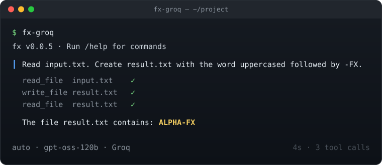

```text
  __                                  
 / _|_  __      ___  _ __   ___ _ __  
| |_\ \/ /____ / _ \| '_ \ / _ \ '_ \ 
|  _|>  <_____| (_) | |_) |  __/ | | |
|_| /_/\_\     \___/| .__/ \___|_| |_|
                    |_|               
```

**Vercel's `fx` coding agent — running on Groq or OpenRouter.**
Same tiny native agent, no Vercel gateway. Bring your own key.

<p>


</p>



## Run it

You need a key from [Groq](https://console.groq.com/keys) or [OpenRouter](https://openrouter.ai/settings/keys) (prepaid).

```bash
git clone https://github.com/fcavalcantirj/fx-open.git ~/dev/fx-open && cd ~/dev/fx-open && git switch openai-compat
./openai-compat/install.sh     # private Zig 0.16.0 → build → install fx-groq / fx-openrouter → asks for your key
fx-groq                        # or: fx-openrouter
```

Proof it works: `./openai-compat/test.sh fx-groq` — one-shot answer, on-disk tool round-trip, TUI start. ~30 s.

## Use

```bash
fx-groq                                    # interactive, in the current project
fx-groq ask "Explain this repo's build."   # one-shot; asks before running tools
fx-groq ask --yolo --no-save --json "…"    # headless; no prompts, no saved session
```

Inside the TUI: `/help`, `/quit`. Don't switch provider or model via `/setup` / `/model` (see caveats).

## For agents

Claude Code: *"use the fx-open-setup skill"* (`.claude/skills/fx-open-setup/`). Any other agent: paste `openai-compat/docs/AGENT-SETUP-PROMPT.md`.

---

## Details

<details>
<summary><b>Why this fork</b></summary>

Upstream `fx` speaks only Vercel AI Gateway's wire (plus ChatGPT/Grok subscription OAuth); it cannot be pointed at Groq, OpenRouter, Ollama, LiteLLM or any OpenAI-compatible endpoint. Upstream [PR #168](https://github.com/vercel-labs/fx/pull/168) adds that provider but is an open draft, conflicts with `main`, never ran CI, and its TUI panics with the provider active. This fork is PR #168's head (`f0c131c4`) plus a 16-line fix for that panic, verified end to end on both providers. The fix belongs upstream on PR #168.
</details>

<details>
<summary><b>What is in <code>openai-compat/</code></b></summary>

| Path | Purpose |
|---|---|
| `install.sh` / `test.sh` / `sync-upstream.sh` | Installer, the 30-second proof, and the upstream-release sync routine |
| `launchers/fx-groq`, `launchers/fx-openrouter` | Unset gateway vars, source `.env` + profile, exec the custom binary |
| `profiles/*.env` | Per-provider settings (base URL, `chat` style, model). No secrets |
| `patches/0001-openai-compat-tui-catalog-context.patch` | The TUI fix (also a commit on `openai-compat`) |
| `harness/` | Agent harness: `feature_list.json` (49 tasks, all `passes:false`), `claude-progress.txt`, `init.sh` |
| `fx-openai-compat-spec.json` | The same 49 tasks as verified on 2026-08-24, all `passes:true` |
| `tools/gw-capture.py` | Loopback listener proving no request reaches a Vercel gateway URL |
| `docs/` | `demo.svg`, `BUILD_INFO.txt` (provenance), `AGENT-SETUP-PROMPT.md`, `TASK-PROMPT.md` (the original brief) |
</details>

<details>
<summary><b>The TUI fix</b></summary>

With the OpenAI-compatible provider active, interactive mode panicked (`attempt to use null value`): `src/main.zig` handed the TUI catalog preload `builtin_providers.modelCatalog(.openai)` whose `context` is null, and `openai_compatible_models.zig:20` unwrapped it. The CLI path already attached `startup.openAiCompatibleConfig()`; the patch (+16/−2 in `src/main.zig`) does the same for the preload/warmup paths. `fx ask` was never affected.
</details>

<details>
<summary><b>Verified on 2026-08-24 (macOS arm64)</b></summary>

- Build: PR #168 head compiles clean on Zig 0.16.0 (2.5–3.5 min cold). Fake-server e2e tests 5/5. Unit tests 8491 pass / 4 skip / 8 fail / 1 crash, identical before and after the patch (6 of the 9 also fail on upstream `main` here; none affect `fx ask`).
- Groq `openai/gpt-oss-120b`: auth, catalog (13 models, 4 tool-capable), streamed single-delta tool calls, `fx ask`, on-disk `ALPHA-FX` round-trip, multi-step tasks, 13k-char streams, interactive TUI, zero requests to a loopback gateway.
- OpenRouter `z-ai/glm-5.3` (control `openai/gpt-oss-120b`): same set, with fragmented tool-call arguments and `: OPENROUTER PROCESSING` keepalives; HTTP errors surface as `fx ask: API request failed · HTTP 400 · …`.
</details>

<details>
<summary><b>Caveats</b></summary>

- OpenRouter pre-reserves credit for fx's `max_tokens` (65 536): a low balance yields `HTTP 402` on every request. Keep a few dollars there.
- `/setup` → *Switch provider* and `/model` persist `provider: openai` into the shared `~/.fx/settings.json`; a stock fx 0.0.5 then reports `malformed_settings`. Change models by editing `FX_MODEL` in `~/.config/fx-groq/env` / `~/.config/fx-openrouter/env` instead.
- Interactive runs save sessions a stock fx cannot read (`fx doctor` → `[fail] session … projection_invalid`). Use `--no-save` for throwaways.
- `status` / `doctor` report Gateway auth as missing under this configuration; `ask` and the TUI work regardless.
- Upstream P1s in PR #168, not patched: Escape may not abort a streaming reply on the chat wire; a bare SSE EOF is treated as a completed turn; mid-stream `data: {"error": …}` events are not inspected.
- Never set `FX_PROVIDER=openai` (startup fails with `OpenAiModelNotSelected`). Never run `fx upgrade` — it would overwrite a stock `fx` on PATH.
</details>

<details>
<summary><b>Manual setup (what <code>install.sh</code> does)</b></summary>

```bash
# 1. Zig 0.16.0 — self-contained, stays off your PATH (other platforms: https://ziglang.org/download/)
mkdir -p ~/.local/lib && cd ~/.local/lib
curl -fsSLO https://ziglang.org/download/0.16.0/zig-aarch64-macos-0.16.0.tar.xz
tar -xJf zig-aarch64-macos-0.16.0.tar.xz && mv zig-aarch64-macos-0.16.0 zig-0.16.0 && rm zig-aarch64-macos-0.16.0.tar.xz

# 2. Build the openai-compat branch
cd ~/dev/fx-open && git switch openai-compat
~/.local/lib/zig-0.16.0/zig build -Doptimize=ReleaseSafe
./zig-out/bin/fx --help | grep 'provider <gateway|codex|grok|openai>'

# 3. Install binary, launchers, key-free profiles
mkdir -p ~/.local/lib/fx-openai-compat ~/.local/bin ~/.config/fx-groq ~/.config/fx-openrouter
cp zig-out/bin/fx ~/.local/lib/fx-openai-compat/fx && chmod 755 ~/.local/lib/fx-openai-compat/fx
cp openai-compat/launchers/fx-groq openai-compat/launchers/fx-openrouter ~/.local/bin/ && chmod 755 ~/.local/bin/fx-groq ~/.local/bin/fx-openrouter
install -m 600 openai-compat/profiles/fx-groq.env ~/.config/fx-groq/env
install -m 600 openai-compat/profiles/fx-openrouter.env ~/.config/fx-openrouter/env

# 4. Keys — one private, gitignored file the launchers source (~/dev/fx-open/.env)
cp openai-compat/.env.example .env && chmod 600 .env    # GROQ_API_KEY=... / OPENROUTER_API_KEY=...
```

The profiles map `OPENAI_API_KEY` from `.env` at runtime and set `FX_OPENAI_BASE_URL`, `FX_OPENAI_API_STYLE=chat`, `FX_MODEL`, `FX_SKIP_ONBOARDING=1`, `FX_DISABLE_KEYCHAIN=1`. No file except `.env` ever holds a key.
</details>

<details>
<summary><b>Contributing upstream</b></summary>

The fix belongs on PR #168 (`boozedog/fx:feature/openai-compatible-transport`). A PR from `openai-compat` against `vercel-labs/fx` `main` would conflict: `main` is 100+ commits ahead and renamed the gateway modules PR #168 still imports.
</details>

<details>
<summary><b>Staying current with upstream</b></summary>

Upstream's `CI` and `Full CI` run on this fork (public repo, free runners); the release/publish workflows are disabled — they need upstream's secrets. `main` tracks upstream **releases**, not dev: `./openai-compat/sync-upstream.sh` reports the latest upstream release, where `main` stands, and whether PR #168 moved or merged; `--apply` re-creates `main` as that release tag plus one commit with the fork's files, and pushes. `openai-compat` stays on PR #168 `f0c131c4` + the fix until PR #168 lands upstream.
</details>

Upstream project: [vercel-labs/fx](https://github.com/vercel-labs/fx) — tiny, open, embeddable, native coding agent (Apache-2.0).
